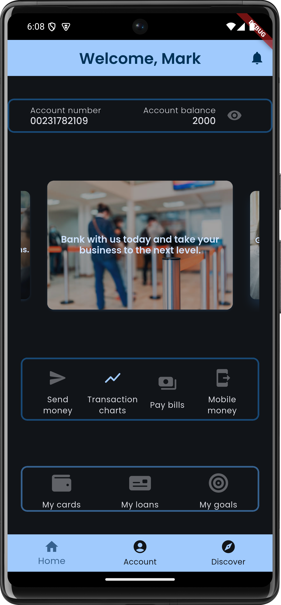

# MyBank
***MyBank*** is an simple Flutter application that allows one to transcact at a cheaper and convenient price as compared to other providers.

The main purpose of this project is to provide a user-friendly interface. It will use mock data for display.

---
## Features
The guaranteed features will be as follows:

1. Account management.
2. Biometric and PIN authorization.
3. Visual data summary through charts.
4. Database management using SupaBase.

Other features are:

1. Responsive user interface for device orientation.
2. Light and dark themes.

## User Interface Preview

1. *Login Screen*

2. *Registration screen, both in light and dark themes*

| Dark theme | Light theme |
| ----- | ----- |
 | 

3. *Dashboard responsive UI*

|Portrait | Landscape|
| ---- | ---- |
 | 

3. *Account details*

4. *Supabase control*

5. *Transaction charts responsive UI*

| Portrait | Landscape |
|----| ----|
 | 

